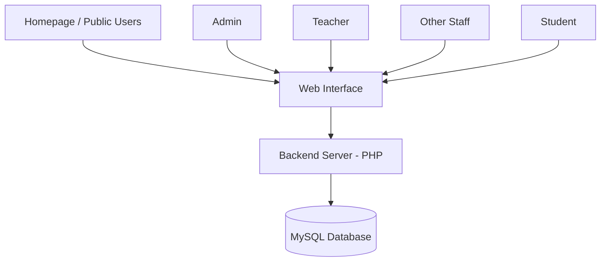

# 🏫 School Management System

A **role-based School Management System** built with **PHP, MySQL, HTML, CSS, and JavaScript**, designed to streamline administrative, academic, and student-related operations. The system provides secure session-based logins, dashboards, analytics, timetables, and more for different user roles.

---

## 🚀 Features

### 🌐 Public Homepage

* View **latest school events and achievements** without login.
* Submit **feedback** via a public feedback corner.

### 🔑 Admin

* Manage users (**Add, Update, Delete**).
* Assign teachers and subjects to classes using the **timetable manager**.
* View feedback from visitors.
* Access **analytics**:

  * Attendance by class
  * Academic performance
  * User statistics
* Manage homepage content (**events and achievements**).
* Dashboard with **dynamic graphs and stats**.

### 👨‍🏫 Teacher

* View assigned classes and subjects.
* **Mark attendance** for students.
* Manage and update student **marks**.
* Access personal timetable.
* View and update profile.

### 👷 Other Staff (Librarians, Guards, etc.)

* Role-specific dashboard with contact details.
* View and update personal profile.
* See **upcoming events and announcements**.

### 👨‍🎓 Student

* View academic performance and attendance.
* Download report card.
* Access timetable.
* Edit and update profile.

---

## 🛠️ Technologies Used

* **Frontend:** HTML, CSS, JavaScript
* **Backend:** PHP
* **Database:** MySQL
* **Web Server:** Apache (XAMPP recommended)
* **Libraries/Tools:** Chart.js (for analytics and graphs)

---

## 📂 Project Structure

```
School-Management-System/
│-- index.php            # Homepage
│-- login.php            # Login page
│-- unauthorized.php     # Unauthorized access page
│-- /admin               # Admin dashboard and modules
│-- /teacher             # Teacher dashboard and modules
│-- /student             # Student dashboard and modules
│-- /staff               # Other staff dashboard
│-- /assets              # CSS, JS, and images
│-- /includes            # Database connection, session management
│-- /uploads             # User profile images, report cards
│-- database.sql         # MySQL database schema
```

---

## 🖥️ System Architecture



---

## ⚠️ Security Features

* **Session-based login** with role distinction.
* **SQL Injection prevention** using `mysqli_real_escape_string()`.
* **Unauthorized access handling** with redirection.
* **Data validation** on all user inputs.

---

## 📈 Future Enhancements

* Enable **secondary attendance authority** for teachers.
* Revamp UI using **modern responsive frameworks**.
* Divide modules for **Primary, O/L, and A/L students**.
* Add **real-time notifications** (email/SMS/in-app).
* Introduce **assignment uploads and homework management**.

---

## 📷 Screenshots


## ⚡ Installation Guide

1. **Clone the repository**

   ```bash
   git clone https://github.com/KPulathisi/School-Management-System.git
   ```

2. **Import the database**

   * Open `phpMyAdmin`.
   * Create a new database (e.g., `school_management`).
   * Import `database.sql`.

3. **Configure database connection**

   * Go to `/includes/db_connect.php`.
   * Update database credentials (`DB_HOST`, `DB_USER`, `DB_PASS`, `DB_NAME`).

4. **Run the system**

   * Place the project folder in `htdocs` (if using XAMPP).
   * Start Apache & MySQL.
   * Open [http://localhost/School-Management-System](http://localhost/School-Management-System).

---

## 👨‍💻 Author

**Kavinda Pulathisi**
Undergraduate IT Student – SLIATE Tangalle
📍 Colombo, Sri Lanka


